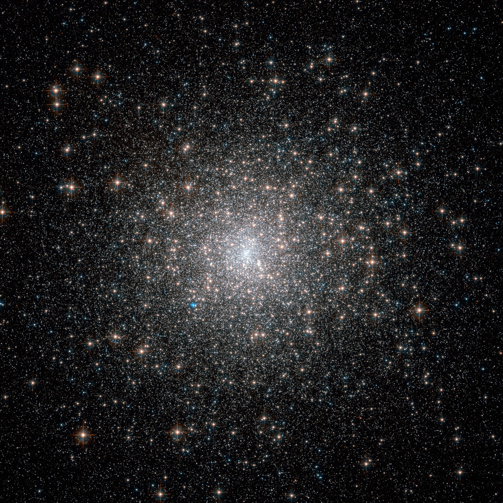
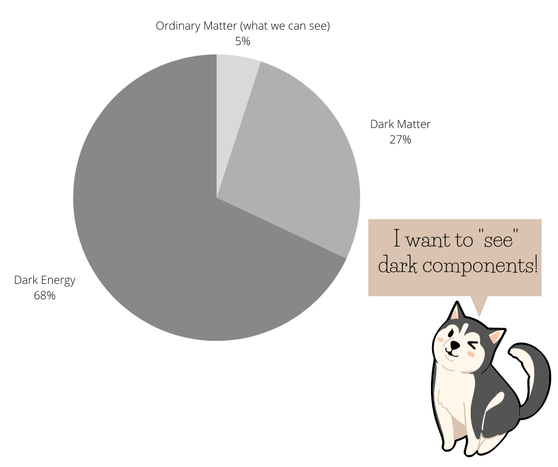
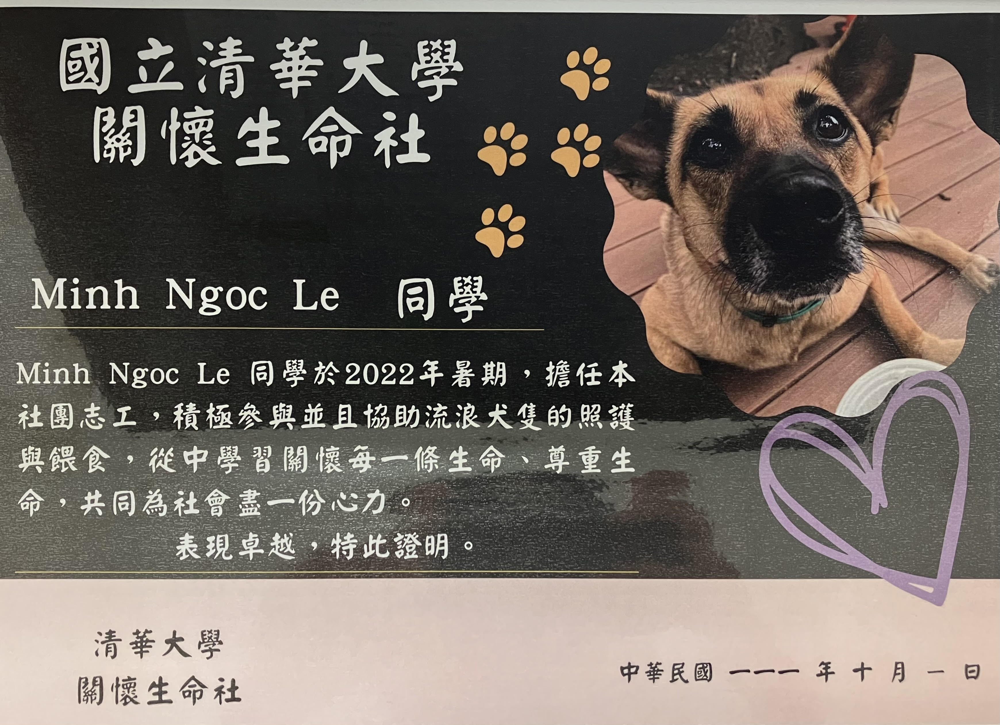

# Hello, this is Ngọc!

I am a master's student in Astrophysics.

My full name in Vietnamese is **Lê Minh Ngọc** (last + middle + first). Somehow they don't let me board the airplane so I need to write my name as _Minh Ngoc Le_ (middle + first + last) to get my flight tickets.

Vietnamese people call others by their first names, so feel free to call me _"Ngoc"_ (pronounce: _ŋok_, with _"ŋ"_ sounds as _"ng"_ in the word _"si**ng**"_). You can find how to pronounce it [here](https://forvo.com/user/ngocle0915/). 

## Where I am now

I am currently at **Leiden Observatory**, the Netherlands! (from Jun to mid-Aug, 2023)

I am here doing my internship on studying turbulence in molecular clouds, with Dr. Piyush Sharda and Dr. Mathilde Bouvier.

## Research interests

**The bright side**: 

I would like to find the answers to the birth of globular clusters and galaxies.

**The dark side**: 

I am very much interested in using the relationship between the bright side and the dark side (galaxy-halo connection) to study how our universe grows up.

## Research projects

- I am working on my master's project with Dr. Andrew Cooper about _primordial globular cluster_ formation. The primordial GC formation hypothesis was introduced by Peeble (1984), which proposed that GC can form inside its own dark matter (DM) halo. To study that, we use the extended Press-Schechter method (code from Parkinson et al. 2008) and input the modeling conditions of primordial GCs formation. We can reproduce the relationship between the number of GCs and DM halo mass, which agree with observational results on low-mass halos.
  
Some results of this work have already been presented at the [IAU 377 Symposium: EARLY DISK-GALAXY FORMATION
FROM JWST TO THE MILKY WAY](https://www.mso.anu.edu.au/~yting/Malaysia_IAU/). You can find my poster [here](poster.pdf). 

The image above shows an old, beautiful GC named Messier 15, which is one of the oldest known GCs. (Image Credit: ESA/Hubble & NASA).

- Alongside GC, I am in love with the dark components of the universe. In spite of no detection (that's why they named _"dark"_), they are proven to be dominant components of our universe. _Dark Energy_ contributes to the expansion of the universe and _Dark Matter_ gravitationally interacts with baryonic matter to form the structure we see nowadays. I did an intern project at ASIAA, Taiwan with Dr. Teppei Okumura and Dr. Aniket Agarwal on calculating DM halos correlation functions, using a mock catalog.  By doing that project, I wrote my own code to calculate the correlation function in Fortran.

- In my bachelor thesis, I studied the inflation caused by Higgs-Dilaton scalar fields in Two-Times Physics, with Dr. Vo Quoc Phong. We would like to test whether a higher dimensional factor could affect the inflation process. We found no evidence for the higher dimensional fields in Two-Time could run inflation.  
 

## Education

- (2020-now) MSc. in Astronomy (expected), National Tsing Hua University, Taiwan. 
- (2014-2018) BSc. in Physics (major in Theoretical Physics), The University of Science - Vietnam National University in Ho Chi Minh City, Vietnam.

## Publications and presentations

- (2023.05) Poster: _Primordial Globular Cluster models could explain the relation between globular cluster number -- dark matter halo mass_, at The 2023 Scientific Assembly of the Astronomical Society of the Republic of China (ASROC2023), in Kaohsiung, Taiwan.

- (2023.02) Poster: _Primordial Globular Cluster models could explain the globular cluster number --  halo mass relation_, at IAU 377 Symposium: EARLY DISK-GALAXY FORMATION
FROM JWST TO THE MILKY WAY in Kuala Lumpur, Malaysia.

- (2020.01) Seminar: _Velocity correlation function: discrepancies between simulation and theory prediction_, at International Center for Interdisciplinary Science and Education, Quy Nhon, Vietnam.

- (2019.12) Lunch talk: _Velocity correlation function: discrepancies between simulation and theory prediction_, at Academia Sinica Institute of Astronomy and Astrophysics, Taiwan.

- (2019.08) Oral presentation: _Inflation via Higgs-Dilaton potential in Two-Time Physics_, at 15th Rencontres du Vietnam: Cosmology 2019, International Center for Interdisciplinary Science and Education, Quy Nhon, Vietnam.
 
 - (2019.02) Poster presentation: _Inflation Scenarios via Dilaton in Two-Time Physics_, at 2019 Asian-Pacific Winter School and Workshop on Gravitation and Cosmology, Yukawa Institute for Theoretical Physics, Kyoto University, Japan.	

## CV
More about my background study, academic activities (schools, workshops, conferences,...) can be found in [my CV](Minh_Ngoc_LE_CV.pdf)

## In my free time

- I enjoy singing very much. Besides, I am also a Ukulele beginner (mine named _"Erling"_, which means _"twenty"_ since I brought _him_ home on the last day of 2020, in my 20s-year-old).
- As a typical dog person, I love playing with dogs and can spend hours talking to them. Attached is the photo of my certificate for volunteering to take care of dogs on the NTHU campus. The dog on the certificate is named Chiao Chiao, she is my favorite one! (I would love to share more [dogs' photos](https://www.instagram.com/schrodinger_dogs/)).

- I also love writing - the way I _"talk to myself"_ and store my thought, experience, and what I learned from open courses. As any graduate student, I usually face academic problems (stress, loss of motivation, don't know how to work/study efficiently). I have been collecting knowledge and experience from senior people to cope with these issues. In the beginning, I just wanted to write things down for myself. However, I felt that may be helpful for other students who are facing the same obstacles as I did. Therefore, I would like to share what I've collected, especially about how to self-motivate and strengthen mental health under academic pressure, in [this blog](https://life-of-a-grad-student.blogspot.com/).

## How to find me

Find anything interesting? Drop me an email to _lmngoc1509(at)gmail.com_

Follow me on [Twitter](https://twitter.com/_lm_ngoc) for updates on my academic journey!  
