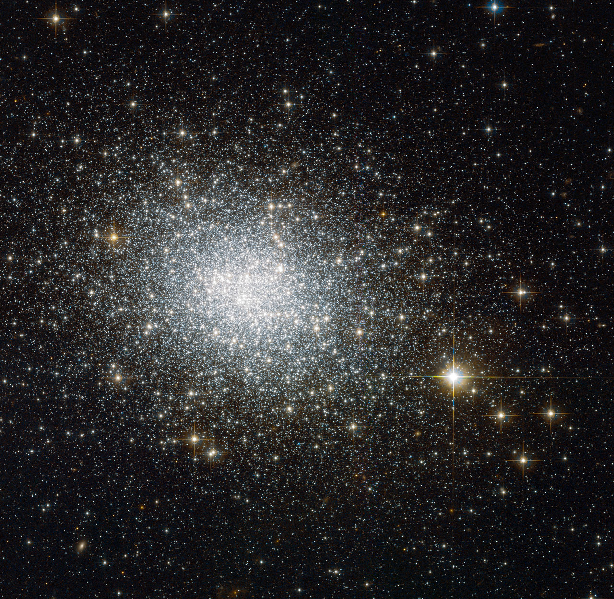

# Welcome to Minh Ngoc Le's Page

I am a graduate student in Astrophysics who is in love with the dark components of the universe. 

My full name is (in Vietnamese) **Lê Minh Ngọc**. Vietnamese's name is written in order: last name + middle name + first name.  We call others by first names, that's why I prefer to be called _"Ngoc"_ (pronounce: _ŋok_, with _"ŋ"_ as _"ng"_ in the word _"sing"_) or you can find how to pronounce it [here](https://forvo.com/user/ngocle0915/).

## Research

- I am working on my master thesis about the formation of _primordial globula clusters_ (GCs). We use the extended Press-Schechter method to trace how primordial GCs formed in their dark matter halos. The above image shows the 10 billion years old GC, taken using Hubble’s Advanced Camera for Surveys (Image Credit: ESA/Hubble & NASA).

- Alongside to that, I am interested in the nature of _Dark Matter_ and _Dark Energy_ , which are dominant components of the universe: _Dark Energy_ contributes on the expanding of universe and _Dark Matter_ gravitationally interacts with baryonic matter to form the structure we see nowadays. I did an intern project on calculating dark matter(DM) halos correlation functions, especially the peculiar velocity of DM halos, and wrote my own code to calculate it.

- In my bachelor thesis, I studied the inflation models with potential due to the Higgs-Dilaton scalar fields in Two-Times Physics. 
 

## Education

- (2014-2018) BSc. in Physics, The University of Science - Vietnam National University in Ho Chi Minh City;
- (2020-now) MSc. in Astronomy (expected), National Tsing Hua University, Taiwan. 

## Publications and presentations

- (2020.01) Seminar: _Velocity correlation function: discrepancies between simulation and theory prediction_, at International Center for Interdisciplinary Science and Education, Quy Nhon, Vietnam.

- (2019.12) Lunch talk: _Velocity correlation function: discrepancies between simulation and theory prediction_, at Academia Sinica Institute of Astronomy and Astrophysics, Taiwan.

- (2019.08) Oral presentation: _Inflation via Higgs-Dilaton potential in Two-Time Physics_, at 15th Rencontres du Vietnam: Cosmology 2019, International Center for Interdisciplinary Science and Education, Quy Nhon, Vietnam.
 
 - (2019.02) Poster presentation: _Inflation Scenarios via Dilaton in Two-Time Physics_, at 2019 Asian-Pacific Winter School and Workshop on Gravitation and Cosmology, Yukawa Institute for Theoretical Physics, Kyoto University, Japan.	

## CV
More about my background study, academic activities (schools, workshops, conferences,...) can be found in [my CV](Minh_Ngoc_LE_CV.pdf)

## In my free time

- I enjoy singing while playing my Ukulele (which named _"Erling"_, means _"tweenty"_ since I brought _him_ home on the last day of 2020, in my 20s year-old).
- As a typical dog person, I love playing with dogs and can spend hours talking to them. Attached is the photo of my certificate for volunteering taking care of dogs in NTHU campus. The dog in the certificate named ChiaoChiao, she is my most favorite one! (I would love to share you more dogs' photos).

- I also love writing - the way I _"talk to myself"_ and store my thought, experience and what I learned from open courses. As a graduate student who usually struggles with academic problems, I have been collecting knowledge and experience from senior people to cope with these issues. In the beginning, I just wanted to write things down for myself. However, I felt that may be helpful for other students who are facing obstacles like I did. Therefore, I would like to share what I collected, especially about how to self-motivate and to strengthen mental health under academic pressure, in [this blog](https://life-of-a-grad-student.blogspot.com/).

## Contact me

Find anything interesting? Drop me an email to _lmngoc1509(at)gmail.com_
