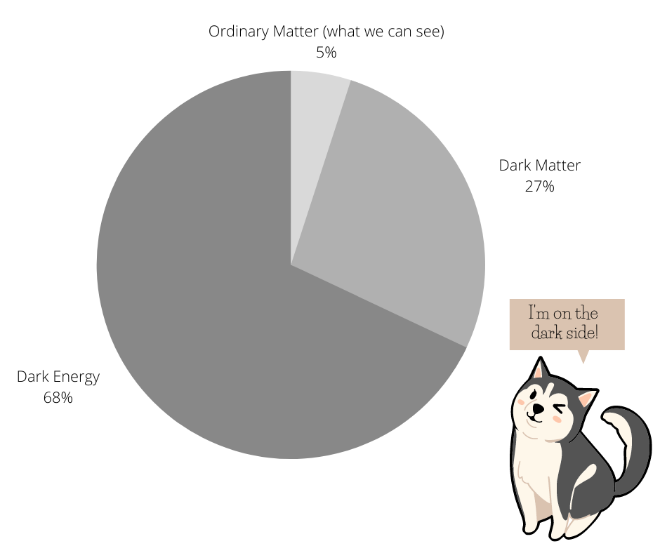

# Hello, I am Minh Ngoc Le

I am a graduate student in Astrophysics who is in love with the dark components of the universe. 

My full name in Vietnamese is **Lê Minh Ngọc**. You can find how to pronounce it [here](https://forvo.com/user/ngocle0915/).

Vietnamese people's names are written in the order: last name + middle name + first name.  We usually call others by first names, that's why I prefer to be called _"Ngoc"_ (pronounce: _ŋok_, with _"ŋ"_ as _"ng"_ in the word _"sing"_). 

## Research interests
- I am working on my master project about _primordial globula clusters_ (GCs) formation, which was first introduced by Peeble & Dickie (1968). They proposed a process that GC can be formed inside their own dark matter(DM) halos. To study that, we use the extended Press-Schechter method (with the code from Parkinson et al. 2008) and input the modeling conditions of primordial GCs formation, to get the number of GCs in DM halos at different masses, and compare to observational data.  

Some results of this work already be presented at the [IAU 377 Symposium: EARLY DISK-GALAXY FORMATION
FROM JWST TO THE MILKY WAY](https://www.mso.anu.edu.au/~yting/Malaysia_IAU/). You can find my poster [here](poster (5).pdf).

The image above shows an old, beautiful GC named Messier 15, which is one of the oldest known GC. (Image Credit: ESA/Hubble & NASA).

- Alongside to GC project, I am interested in the nature of _Dark Matter_ and _Dark Energy_. In spite of no detection (that's why they named _"dark"_), they are proved to be dominant components of our universe. _Dark Energy_ contributes on the expanding of universe and _Dark Matter_ gravitationally interacts with baryonic matter to form the structure we see nowadays. I did an intern project on calculating DM halos correlation functions, especially the peculiar velocity of DM halos, and wrote my own code to calculate it.

- In my bachelor thesis, I studied the inflation models with potential due to the Higgs-Dilaton scalar fields in Two-Times Physics. We would like to see if higher dimensional factor could affect the inflation process or not.
 

## Education

- (2014-2018) BSc. in Physics (major in Theoretical Physics), The University of Science - Vietnam National University in Ho Chi Minh City, Vietnam;
- (2020-now) MSc. in Astronomy (expected), National Tsing Hua University, Taiwan. 

## Publications and presentations

- (2020.01) Seminar: _Velocity correlation function: discrepancies between simulation and theory prediction_, at International Center for Interdisciplinary Science and Education, Quy Nhon, Vietnam.

- (2019.12) Lunch talk: _Velocity correlation function: discrepancies between simulation and theory prediction_, at Academia Sinica Institute of Astronomy and Astrophysics, Taiwan.

- (2019.08) Oral presentation: _Inflation via Higgs-Dilaton potential in Two-Time Physics_, at 15th Rencontres du Vietnam: Cosmology 2019, International Center for Interdisciplinary Science and Education, Quy Nhon, Vietnam.
 
 - (2019.02) Poster presentation: _Inflation Scenarios via Dilaton in Two-Time Physics_, at 2019 Asian-Pacific Winter School and Workshop on Gravitation and Cosmology, Yukawa Institute for Theoretical Physics, Kyoto University, Japan.	

## CV
More about my background study, academic activities (schools, workshops, conferences,...) can be found in [my CV](Minh_Ngoc_LE_CV.pdf)

## In my free time

- I enjoy singing very much. Besides, I am also a Ukulele beginner (mine named _"Erling"_, means _"tweenty"_ since I brought _him_ home on the last day of 2020, in my 20s year-old).
- As a typical dog person, I love playing with dogs and can spend hours talking to them. Attached is the photo of my certificate for volunteering taking care of dogs in NTHU campus. The dog in the certificate named ChiaoChiao, she is my most favorite one! (I would love to share you more dogs' photos).

- I also love writing - the way I _"talk to myself"_ and store my thought, experience and what I learned from open courses. As any graduate student, I usually faces with academic problems (stress, lose motivation, don't know how to work/study efficiently). I have been collecting knowledge and experience from senior people to cope with these issues. In the beginning, I just wanted to write things down for myself. However, I felt that may be helpful for other students who are facing the same obstacles like I did. Therefore, I would like to share to public what I've collected, especially about how to self-motivate and to strengthen mental health under academic pressure, in [this blog](https://life-of-a-grad-student.blogspot.com/).

## Contact me

Find anything interesting? Drop me an email to _lmngoc1509(at)gmail.com_
